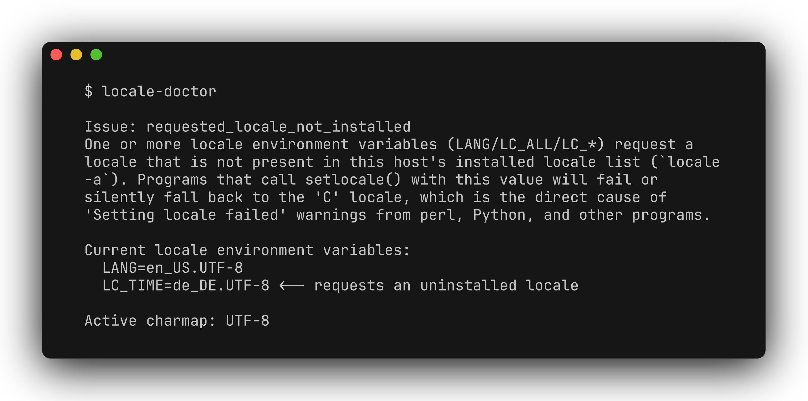

# locale-doctor

[](README.md) [](README.zh-CN.md)

排查当前 shell 或 SSH 会话中的 locale 警告和可能的编码不匹配。locale-doctor 会对照主机已安装的 locale，检查当前字符编码，并提示 SSH 转发 locale 变量的潜在风险，全程只读。



[演示视频](docs/demo.mp4)

## 环境与安装

需要 Python 3.9+ 和 POSIX `locale` 命令，主要面向 Linux；环境变量和字符编码检查也可在 macOS/BSD 运行。无 Python 运行时依赖。

```bash
git clone https://github.com/zhuhroscar-tech/locale-doctor.git
cd locale-doctor
python3 -m venv .venv
source .venv/bin/activate
python -m pip install -e ".[dev]"
```

## 快速使用

```bash
locale-doctor
locale-doctor --json
locale-doctor --no-sshd-check
```

请**在出现问题的会话内运行**：工具读取当前进程的环境，不是其他用户的登录设置。它将 `LANG`、`LANGUAGE`、`LC_ALL` 及已知的 `LC_*` 变量与 `locale -a` 对照，再检查当前 charmap，并可读取 `/etc/ssh/sshd_config` 及其直接 Include 的文件。

退出码 `0` 表示已执行的检查未发现问题；`2` 包括缺失 locale、非 UTF-8 编码、转发风险，以及无法获取已安装 locale 列表。`AcceptEnv` 警告只是潜在风险，不证明客户端已经发送了无效值。

无需安装时，可从[发布页面](https://github.com/zhuhroscar-tech/locale-doctor/releases)下载 `locale-doctor.pyz`，核对同版本的 `SHA256SUMS.txt` 后运行 `python3 locale-doctor.pyz`。

## 如何处理结果

缺少 locale 时，使用发行版工具生成对应 locale，或停止转发不受支持的值。编码不匹配时，改用已安装的 UTF-8 locale。调整 SSH 策略前，应同时核查客户端的 `SendEnv` 和服务端的 `AcceptEnv`。

工具不会运行 `locale-gen`、修改配置、写入持久状态或发出网络请求。无法读取的 SSH 配置会被跳过，未知 charmap 不会触发告警。SSH 检查只是文本扫描，不等于计算 `sshd` 的实际生效策略，也不会完整解析嵌套 Include 和条件块。因此，“未发现问题”不能证明所有 locale 或 SSH 设置都正确。输出包含 locale 环境变量值，分享前请先检查。

## 开发与卸载

```bash
python -m pytest -q
python -m pip uninstall locale-doctor
```

[发布文件](https://github.com/zhuhroscar-tech/locale-doctor/releases) · [MIT 许可证](LICENSE)
